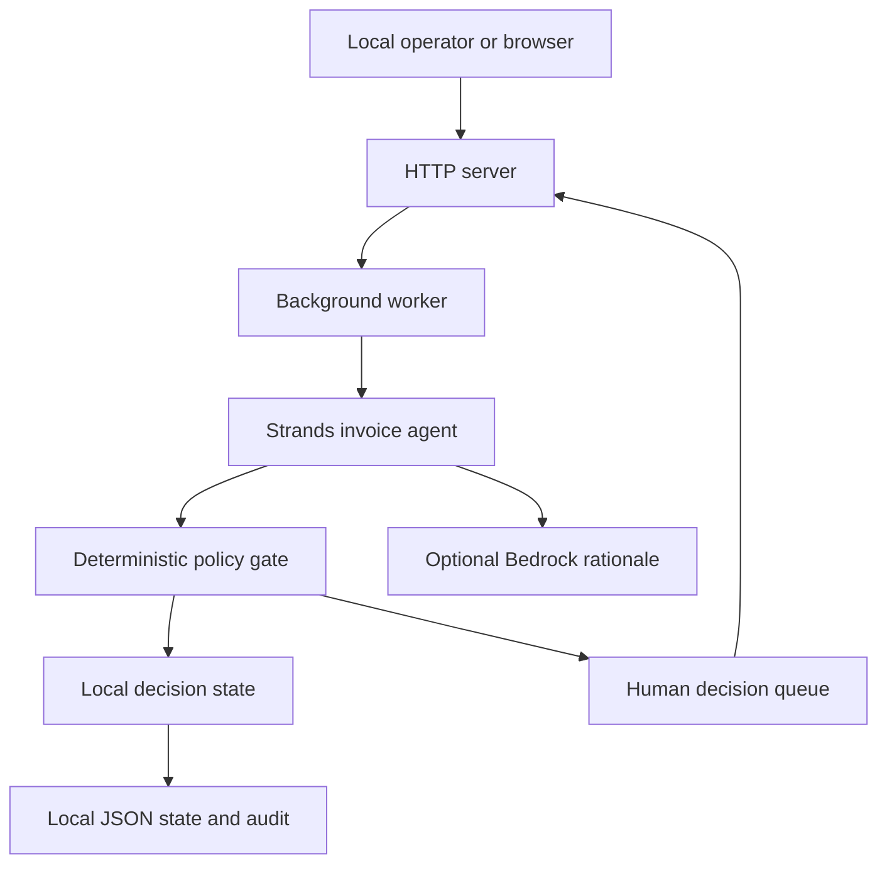

# Clearline threat model

## Executive summary

Clearline is a local Python HTTP demo for triaging synthetic invoices. Its strongest control is architectural: `StrandsInvoiceAgent` may add an optional explanation, but `classify_invoices` and the deterministic policy gate decide whether an invoice is auto-filed (`clearline/agent.py`, `clearline/domain.py`). The highest-risk condition is operating the unauthenticated server on a non-loopback interface: a network client could read local queue state or mutate human decisions. Live rationale mode adds a second conditional boundary because invoice fields are sent to the provider selected by the Strands SDK. Neither risk is present in the default credential-free, loopback demo unless an operator changes that context.

## Scope and assumptions

- In scope: `clearline/__main__.py`, `clearline/server.py`, `clearline/worker.py`, `clearline/store.py`, `clearline/agent.py`, `clearline/domain.py`, `clearline/fixtures.py`, and the static UI under `clearline/static/`.
- Build and release context: `pyproject.toml`, the public GitHub repository, and the package artifact. Tests are evidence of controls, not runtime components.
- Intended deployment: one operator on a trusted machine, bound to `127.0.0.1`, using synthetic fixtures and a local JSON state file. The CLI accepts `--host`, so a non-loopback deployment is possible but is not an approved production posture (`clearline/__main__.py`, `clearline/server.py:create_server`).
- Live mode assumption: `CLEARLINE_STRANDS_LIVE=1` is an explicit opt-in. The Strands SDK may call Amazon Bedrock using the normal AWS credential chain; this repository does not implement provider authentication or data-retention controls (`clearline/agent.py:_build_strands_agent`, `README.md`).
- Out of scope: payment rails, vendor email, multi-user tenancy, internet deployment, accounting correctness, production access control, and AWS account administration. No payment or messaging client exists in the runtime paths reviewed (`docs/spec.md`, `clearline/agent.py`).
- Context validation: no separate service-owner or deployment questionnaire was supplied; priorities below retain the explicit local-demo assumptions and mark public exposure as conditional.

## System model

### Primary components

- `__main__.py` starts `ThreadingHTTPServer` and exposes configurable host/port.
- `server.py` routes static files, state reads, sweeps, and human decisions.
- `BackgroundWorker` owns the sweep trigger; `ClearlineStore` owns policy state, human decisions, persistence, and audit events.
- `StrandsInvoiceAgent` runs deterministic classification and optionally requests a rationale from Strands/Bedrock.
- `static/` is a browser client that calls the local HTTP API; it does not contain a second policy engine.

### Data flows and trust boundaries

- **Fixture → worker → agent/policy:** eight developer-controlled synthetic `Invoice` records cross in-process calls. `classify_invoices` creates a decision for every record; policy reasons and statuses are structured before persistence (`clearline/fixtures.py`, `clearline/domain.py:classify_invoices`).
- **Browser or HTTP client → API server:** JSON bodies and URL paths cross an HTTP boundary. `do_POST` accepts `/api/run` and `/api/invoices/<id>/decision`; decision bodies are limited to 16 KiB and must decode to an object (`clearline/server.py:31-70`). There is no authentication, TLS, origin check, or rate limit.
- **API server → local state file:** the store writes decisions and audit events through a temporary file followed by `replace`, which reduces partial-write risk. File confidentiality and permissions are delegated to the host (`clearline/store.py:_persist`).
- **Agent → optional provider:** live mode sends a rationale prompt containing invoice number, vendor, amount, policy cap, deterministic reasons, and recommendation to the Strands-created agent. Provider transport, authentication, and retention are outside this repository (`clearline/agent.py:_rationale_prompt`, `_build_strands_agent`).
- **API server → browser:** `/api/state` returns the full queue, policy metadata, decisions, and audit entries; the browser escapes displayed values before inserting them into HTML (`clearline/server.py:21-29`, `clearline/static/app.js:9`).

#### Diagram

## Assets and security objectives

| Asset | Why it matters | Security objective |
| --- | --- | --- |
| Invoice fields and queue state | Future deployments could contain vendor, amount, PO, or other business data; the demo currently uses synthetic records (`clearline/fixtures.py`). | C/I |
| Decision status and audit entries | A false approval or erased audit event undermines the human-control promise (`clearline/store.py`). | I/A |
| AWS credential chain | Live mode depends on ambient credentials; compromise could affect the AWS account beyond this app (`README.md`, `clearline/agent.py`). | C/I |
| Local state file | It is the restart source of truth and contains decisions/audit history (`clearline/store.py:_load`, `_persist`). | C/I/A |
| HTTP service availability | The operator needs the queue to review exceptions; `ThreadingHTTPServer` has no application rate limit (`clearline/server.py`). | A |
| Public source and wheel | Judges and users need reproducible, untampered code and declared dependencies (`pyproject.toml`, `LICENSE`, public repository). | I/A |

## Attacker model

### Capabilities

- A remote client can send arbitrary HTTP paths, headers, JSON bytes, and decision actions if an operator binds the server to a reachable non-loopback interface.
- A local user or process with read/write access to the host can inspect or modify the JSON state file and process environment.
- A dependency or provider compromise can influence optional live rationale behavior, subject to the deterministic policy result remaining authoritative.

### Non-capabilities

- An HTTP client cannot pay a vendor, send email, or call a payment API because those integrations are absent from the runtime.
- A remote attacker cannot be assumed to read the host filesystem or AWS environment when the server remains on loopback.
- The default demo has no real customer PII or production ledger; impact estimates for those assets are conditional on future reuse with real data.

## Entry points and attack surfaces

| Surface | How reached | Trust boundary | Notes | Evidence |
| --- | --- | --- | --- | --- |
| Health/state reads | `GET /health`, `GET /api/state` | HTTP client → server | State response includes queue and audit data; no auth. | `clearline/server.py:21-29` |
| Background sweep | `POST /api/run`, startup | HTTP client/process → store | Repeated sweep is idempotent for existing decisions, but is not rate limited. | `clearline/server.py:31-35`, `clearline/worker.py` |
| Human decision | `POST /api/invoices/<id>/decision` | HTTP client → store | Only `approve`/`hold` and surfaced invoices are accepted. | `clearline/server.py:36-48`, `clearline/store.py:58-87` |
| JSON parser | Decision request body and `Content-Length` | Attacker-controlled bytes → handler | Body is bounded and must be a JSON object; malformed values return 400. | `clearline/server.py:_read_json`, `tests/test_server.py` |
| Static file route | Any non-API `GET` path | URL path → local package files | Resolved path must remain under `static/`. | `clearline/server.py:_static` |
| Provider rationale | `CLEARLINE_STRANDS_LIVE=1` | Local process → Strands/Bedrock | Optional prompt contains invoice context; provider controls are external. | `clearline/agent.py:20-41`, `:44-68` |
| State file | Startup and every write | Local process → filesystem | Atomic temporary replacement; no encryption, locking across processes, or integrity signature. | `clearline/store.py:89-132` |

## Top abuse paths

1. **Expose state:** operator starts with `--host 0.0.0.0` → unauthenticated client calls `GET /api/state` → queue and audit data are disclosed.
2. **Forge a human action:** reachable client identifies a surfaced invoice → posts `approve` → local decision state records an approval without the intended operator.
3. **Exhaust service threads:** reachable client sends repeated `/api/run` or state requests → worker and request threads consume CPU/resources → operator cannot review the queue promptly.
4. **Leak live context:** operator enables live mode with real invoice data → rationale prompt crosses the Strands/Bedrock boundary → provider retention or account configuration determines confidentiality.
5. **Corrupt the source of truth:** local process edits or removes the JSON state → restart loads altered state or resets after parse failure → decision/audit integrity is weakened.
6. **Compromise ambient credentials:** a local process reads the AWS credential environment/profile used by live mode → provider access is abused outside Clearline’s policy boundary.

## Threat model table

| Threat ID | Threat source | Prerequisites | Threat action | Impact | Impacted assets | Existing controls (evidence) | Gaps | Recommended mitigations | Detection ideas | Likelihood | Impact severity | Priority |
| --- | --- | --- | --- | --- | --- | --- | --- | --- | --- | --- | --- | --- |
| TM-001 | Remote HTTP client | Operator binds a reachable non-loopback host; no upstream auth. | Read `/api/state` and harvest invoice/audit data. | Confidentiality loss; demo data is synthetic, but the same route would expose future business data. | Invoice fields, audit, state file | Default host is `127.0.0.1`; demo uses synthetic fixtures (`__main__.py`, `fixtures.py`). | No auth, TLS, origin check, or deployment guard when `--host` changes. | Keep loopback-only for demos; for any shared deployment add authenticated access, TLS, authorization, and a documented reverse proxy/rate limit. | Alert on non-loopback bind; access log and monitor state-read volume. | medium if misconfigured, low by default | medium | medium |
| TM-002 | Remote HTTP client | Same exposure as TM-001 plus a known surfaced invoice ID. | Post `approve` or `hold` and impersonate the operator. | Decision integrity loss; an unauthorized approval would violate the human-gate promise. | Decision state, audit | Store accepts only valid actions for `needs_review`; auto-filed decisions reject human actions; audit records the request (`store.py:58-87`). | No caller identity or authorization exists. | Do not expose the demo; if deployed, require authenticated operator identity and authorization, bind audit entries to that identity, and use CSRF protection for browser sessions. | Alert on decisions from unexpected source/identity and on action bursts. | medium if misconfigured, low by default | medium in demo, high with real ledger | medium |
| TM-003 | Remote HTTP client | Reachable server; repeated requests. | Flood `/api/run` or `/api/state` and consume threads/CPU. | Availability loss and delayed human review. | HTTP service, compute, decision budget | Sweeps preserve decisions and audit idempotency; JSON body is capped at 16 KiB and non-object JSON is rejected (`server.py`, `test_server.py`). | No rate limit, connection cap, request timeout policy, or authenticated queue trigger. | Keep loopback-only; otherwise add reverse-proxy limits, request timeouts, bounded worker concurrency, and rate limits on `/api/run`. | Metrics for request rate, sweep duration, thread count, and 4xx/5xx responses. | low by default, medium when exposed | medium | medium |
| TM-004 | Provider or misconfigured live mode | Operator opts into live mode with non-synthetic invoice data. | Send invoice context to the provider and rely on external retention/access controls. | Confidentiality loss or regulatory exposure; no payment action follows from the prompt. | Invoice fields, AWS account | Live mode is explicit; deterministic status is computed before rationale; rationale is truncated to 600 characters and failures fall back (`agent.py:20-41`). | No redaction, provider policy enforcement, data classification, or configurable model endpoint in this repository. | Keep demo synthetic; for real data add redaction/classification, explicit provider data controls, least-privilege IAM, and a documented retention decision. | Record live-mode usage without prompts; alert on unexpected live-mode enablement or provider errors. | low for default, medium with real data | medium | medium |
| TM-005 | Local process/user | Read/write access to the host or AWS profile. | Read ambient credentials or alter the live-mode environment. | Potential AWS account compromise beyond Clearline. | AWS credentials, AWS account | No credentials are committed or persisted by the app; README directs use of the normal SDK chain (`README.md`). | Local credential security and IAM scope are external; no secret scanning/runtime credential broker. | Use short-lived least-privilege credentials, isolated profiles, and standard AWS secret monitoring; never place credentials in state or repo. | AWS CloudTrail/GuardDuty and repository secret scanning; fail CI on secret patterns. | low in intended local use | high | medium |
| TM-006 | Local process/user or filesystem failure | Access to the state file, concurrent process, or disk failure. | Modify, delete, or race state writes; trigger load reset after malformed JSON. | Decision/audit integrity loss or loss of availability after restart. | State file, audit, decisions | Temporary-file replacement reduces partial writes; load failures clear in-memory state rather than executing arbitrary content (`store.py:89-132`). | No file permissions, cross-process lock, integrity signature, backup, or explicit corruption alert. | Restrict state-file permissions, use a single process, surface a loud integrity error instead of silently resetting for real deployments, and back up/audit state. | Monitor state-file ownership, size/hash changes, load-reset events, and disk errors. | low | medium | low |

## Criticality calibration

- **Critical:** a realistic path to remote code execution, AWS credential theft through the service, cross-tenant data access, or an unauthorized payment. No such path is implemented in the intended local demo; payment integrations are absent.
- **High:** unauthorized approval of a real invoice, broad exposure of real invoice data, or compromise of an AWS account. These become relevant only if the prototype is reused with real data or exposed without an access-control layer.
- **Medium:** unauthenticated state disclosure or decision mutation on a reachable demo, sustained denial of service, or provider disclosure of real invoice context. These are the principal conditional deployment risks.
- **Low:** local state corruption or low-sensitivity demo-data disclosure under the stated trusted-host assumption, where the attacker already has filesystem access.

## Focus paths for security review

| Path | Why it matters | Related Threat IDs |
| --- | --- | --- |
| `clearline/server.py` | All HTTP routing, body parsing, static path resolution, and host exposure converge here. | TM-001, TM-002, TM-003 |
| `clearline/store.py` | Owns the integrity-critical decision state, audit log, persistence, and restart behavior. | TM-002, TM-006 |
| `clearline/agent.py` | Defines the deterministic-vs-model boundary and the data sent to the optional provider. | TM-004, TM-005 |
| `clearline/__main__.py` | Exposes operator-controlled host/port configuration. | TM-001, TM-003 |
| `pyproject.toml` | Declared dependency and package build surface; supply-chain review starts here. | TM-005 |
| `tests/test_server.py`, `tests/test_store.py`, `tests/test_agent.py` | Regression evidence for request validation, human gates, persistence, fallback, and policy authority. | TM-002, TM-003, TM-004, TM-006 |

## Notes on use

This model is a bounded review of the credential-free hackathon prototype, not a production authorization or privacy certification. The applied request guard is validated by `tests/test_server.py`; the broader deployment recommendations remain conditional until an authenticated, multi-user deployment exists. Re-run this model if Clearline gains real inbox ingestion, payment/email integrations, internet exposure, multiple tenants, or non-synthetic invoice data.
