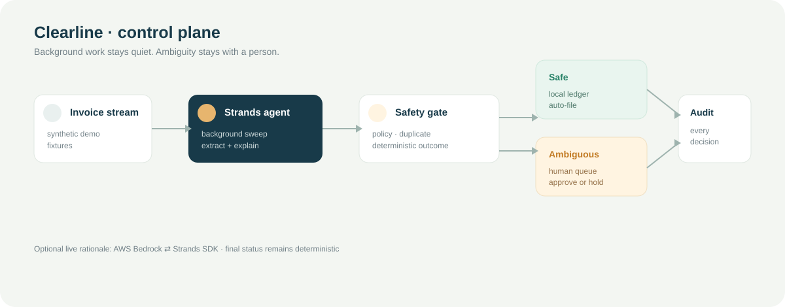

# Clearline

## Only the invoices that need a person.

Clearline is a quiet invoice-approval queue for small professional teams. It runs a background sweep over a shared vendor-invoice inbox, files routine invoices against a visible policy, and surfaces only the cases where a human must decide.

This is a narrow [Agents for Humans](https://agentsforhumans.devpost.com/) hackathon build for the **Professional Agents** track, using the [Strands Agents SDK](https://strandsagents.com/). It is deliberately safe for a demo: the data is synthetic, the only write is a local status and audit entry, and Clearline never pays a vendor or sends an email.



## The 90-second mental model

1. An invoice arrives in the stream.
2. The Strands agent extracts and checks it with policy tools.
3. Safe invoices are filed automatically.
4. Exceptions land in `Needs your call` with evidence.
5. A human explicitly approves or holds the exception.

The default demo path is deterministic so judges can run it without credentials. Set `CLEARLINE_STRANDS_LIVE=1` to let the official Strands SDK add a model-generated rationale through Amazon Bedrock; the deterministic policy gate remains authoritative in both modes.

## Run it locally

```bash
python3 -m venv .venv
source .venv/bin/activate
python -m pip install -e '.[dev]'
python -m clearline
```

Open [http://127.0.0.1:8787](http://127.0.0.1:8787). The demo uses only the Python standard library at runtime; installing the package also installs `strands-agents` for the live path.

The first launch creates `data/clearline-state.json` so a human decision survives a restart. To run a clean recording without touching the repository, point the state file at a temporary path: `CLEARLINE_STATE_FILE=/tmp/clearline-demo.json python -m clearline`.

## Live Strands mode

The live adapter requires Python 3.10+, an AWS account with Bedrock model access, and credentials configured through the normal AWS SDK chain. Then run:

```bash
CLEARLINE_STRANDS_LIVE=1 python -m clearline
```

If Bedrock is unavailable, Clearline records the fallback and continues using the deterministic gate. No secrets are stored in the repository.

## Tests

```bash
python -m pytest -q
```

## Submission materials

- Product spec and acceptance criteria: [`docs/spec.md`](docs/spec.md)
- Architecture: [`docs/architecture.md`](docs/architecture.md)
- Two-minute recording plan: [`docs/demo-script.md`](docs/demo-script.md)
- Truthful submission checklist: [`docs/submission.md`](docs/submission.md)

## License

Apache 2.0. See [`LICENSE`](LICENSE).
