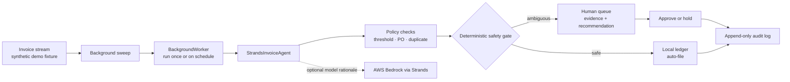

# Clearline architecture

## Why this boundary matters

The background worker owns when a sweep runs; the Strands agent owns the agent/tool seam and optional model rationale; the final outcome is still decided by a small, deterministic policy gate. That makes the demo reproducible and prevents a language model from silently taking a financial action. The only write in this prototype is a local status change and audit entry; it never pays or messages a vendor.

## Runtime modes

- **Demo mode (default):** deterministic fixtures and policy evaluation; no credentials or network required.
- **Live rationale mode:** set `CLEARLINE_STRANDS_LIVE=1` after configuring AWS credentials and Bedrock model access. Strands supplies a concise rationale for surfaced items; policy status stays deterministic.

## Architecture review receipt

On 2026-08-27, this source diagram and the rendered upload artifact were compared with the implementation at code commit `391a75c6375202383c0dd25d04f0ffcd7540b1b2`. The worker, `StrandsInvoiceAgent`, deterministic policy checks, local ledger, human queue, and append-only audit path match the code. The optional Bedrock path is labelled as rationale-only, and no external payment or messaging tool is exposed. The wording above uses `Policy checks` because the threshold, purchase-order, and duplicate logic is implemented in the deterministic domain layer rather than registered as Strands SDK tools. The PNG and SVG remain the same visual artifact; this is a documentation-only clarification.
